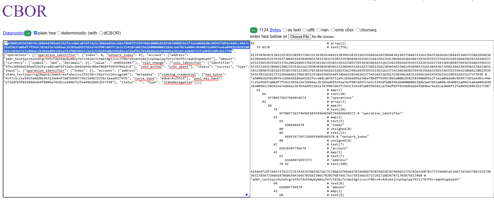
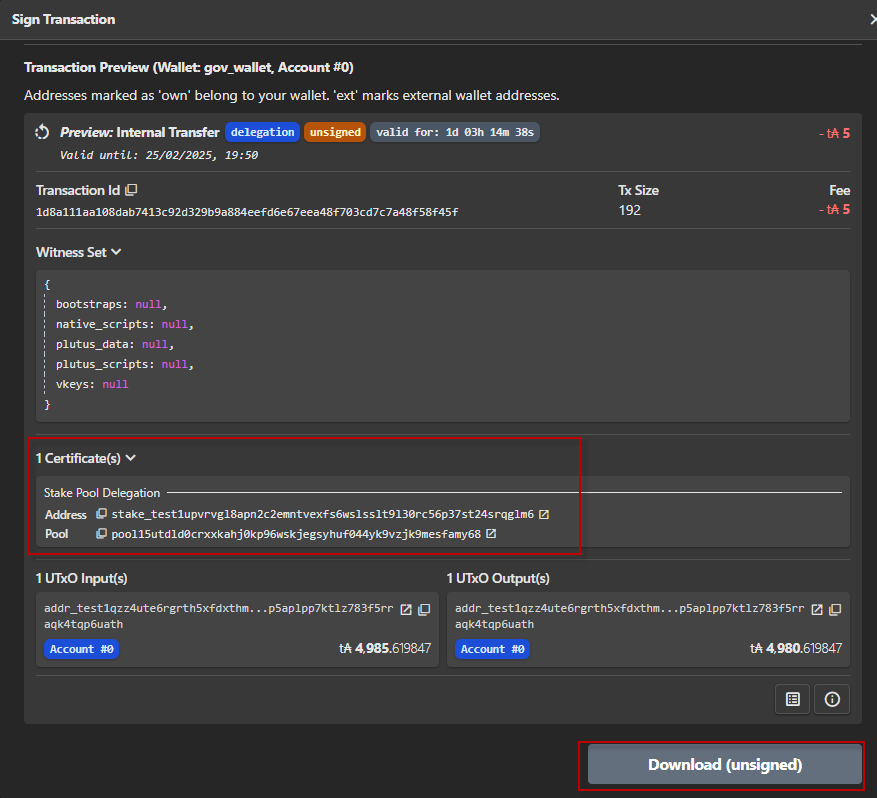

# Building & submitting transactions for stakeDelegation operations in rosetta
## 1. Requirements:
- Your stake address must be registered in advance

## Step 1- construct a request for metadata
Using /construction/preprocess end-point to construct a request for any metadata that is needed for transaction construction
```
curl --location 'localhost:8082/construction/preprocess' \
--header 'Content-Type: application/json' \
--data '{
  "metadata": {
    "deposit_parameters": {
      "poolDeposit": "500000000",
      "keyDeposit": "2000000"
    }
  },
  "network_identifier": {
    "blockchain": "cardano",
    "network": "preview"
  },

     "operations": [
        {
        
            "operation_identifier": {
                "index": 0,
                "network_index": 0
            },
            "type": "input",
            "status": "success",
            "account": {
                "address": "addr_test1qzz4ute6rgrth5xfdxthmy0ym8xyfe7zt62kx7stmal4gtzcxc3706rx4s4nhxkejvnp5aplpp7ktlz783f5rraqk4tqp6uath"
            },
            "amount": {
                "value": "-4985619847",
                "currency": {
                    "symbol": "ADA",
                    "decimals": 6
                }
            },
            "coin_change": {
                "coin_identifier": {
                    "identifier": "976c26864d189a652b2fece0dca076f32a5c2bbb6d56e36bef8b8ff559970d1d:0"
                },
                "coin_action": "coin_spent"
            }
        },
        
        {
            "operation_identifier": {
                "index": 1
            },
            "related_operations": [
                {
                    "index": 0
                }
            ],
            "type": "output",
            "status": "",
            "account": {
                "address": "addr_test1qzz4ute6rgrth5xfdxthmy0ym8xyfe7zt62kx7stmal4gtzcxc3706rx4s4nhxkejvnp5aplpp7ktlz783f5rraqk4tqp6uath"
            },
            "amount": {
                "value": "4980619847",
                "currency": {
                    "symbol": "ADA",
                    "decimals": 6
                }
            }
        },
        
        {
            "operation_identifier": {
                "index": 2
            },
            "type": "stakeDelegation",
            "status": "",
            "account": {
        
                "address": "stake_test1upvrvgl8apn2c2emntvexfs6wslsslt9l30rc56p37st24srqglm6"
            },
            "metadata": {
                "staking_credential": {
        
                    "hex_bytes": "4cf7c1ccee5015a8dd8e563224eb4f7a07b899775633d4b72336c1aae852797b",   
                    "curve_type": "edwards25519"
                },
                "pool_key_hash": "a716dfb5f8198d6ede4fb04ba742d2ca204bf12fad4962b052b17798"
                }
        }
    ]
}'
```

## Step 2- to get metadata for transaction construction
using construction/metadata to get metadata for transaction construction
```
curl --location 'localhost:8082/construction/metadata' \
--header 'Content-Type: application/json' \
--data '{
    "network_identifier": {
        "blockchain": "cardano",
        "network": "preview"
    },
    "options": {
        "relative_ttl": 1000,
        "transaction_size": 261
    }
    }
}'
```

## Step 3:  Generate an Unsigned Transaction
In this step we use /construction/payloads to generate an unsigned transaction

```
curl --location 'localhost:8082/construction/payloads' \
--header 'Content-Type: application/json' \
--data '{
  "metadata": {
    "deposit_parameters": {
      "poolDeposit": "500000000",
      "keyDeposit": "2000000"
    }
  },
  "network_identifier": {
    "blockchain": "cardano",
    "network": "preview"
  },

     "operations": [
        {
        
            "operation_identifier": {
                "index": 0,
                "network_index": 0
            },
            "type": "input",
            "status": "success",
            "account": {
                "address": "addr_test1qzz4ute6rgrth5xfdxthmy0ym8xyfe7zt62kx7stmal4gtzcxc3706rx4s4nhxkejvnp5aplpp7ktlz783f5rraqk4tqp6uath"
            },
            "amount": {
                "value": "-4985619847",
                "currency": {
                    "symbol": "ADA",
                    "decimals": 6
                }
            },
            "coin_change": {
                "coin_identifier": {
                    "identifier": "976c26864d189a652b2fece0dca076f32a5c2bbb6d56e36bef8b8ff559970d1d:0"
                },
                "coin_action": "coin_spent"
            }
        },
        
        {
            "operation_identifier": {
                "index": 1
            },
            "related_operations": [
                {
                    "index": 0
                }
            ],
            "type": "output",
            "status": "",
            "account": {
                "address": "addr_test1qzz4ute6rgrth5xfdxthmy0ym8xyfe7zt62kx7stmal4gtzcxc3706rx4s4nhxkejvnp5aplpp7ktlz783f5rraqk4tqp6uath"
            },
            "amount": {
                "value": "4980619847",
                "currency": {
                    "symbol": "ADA",
                    "decimals": 6
                }
            }
        },
        
        {
            "operation_identifier": {
                "index": 2
            },
            "type": "stakeDelegation",
            "status": "",
            "account": {
        
                "address": "stake_test1upvrvgl8apn2c2emntvexfs6wslsslt9l30rc56p37st24srqglm6"
            },
            "metadata": {
                "staking_credential": {
        
                    "hex_bytes": "4cf7c1ccee5015a8dd8e563224eb4f7a07b899775633d4b72336c1aae852797b",   
                    "curve_type": "edwards25519"
                },
                "pool_key_hash": "a716dfb5f8198d6ede4fb04ba742d2ca204bf12fad4962b052b17798"
                }
        }
    ],
        
    "metadata": {
        "ttl": 73919082,
        "protocol_parameters": {
            "coinsPerUtxoSize": "4310",
            "maxTxSize": 16384,
            "maxValSize": 5000,
            "keyDeposit": "2000000",
            "maxCollateralInputs": 3,
            "minFeeCoefficient": 44,
            "minFeeConstant": 155381,
            "minPoolCost": "170000000",
            "poolDeposit": "500000000",
            "protocol": 10
        }
    },
    "suggested_fee": [
        {
            "value": "167041",
            "currency": {
                "symbol": "ADA",
                "decimals": 6
            }
        }
    ]

}'
```
## Step 4:  Decoding and Signing Payloads
### Step 4.1:  decode unsign rosetta transaction

Access https://cbor.me/, paste the contents of unsigned_transaction to the right box

```
8279017861353030383138323538323039373663323638363464313839613635326232666563653064636130373666333261356332626262366435366533366265663862386666353539393730643164303030313831383235383339303038353565326633613161303662626430633936393937376439316534643963633434653763323565393536333761306264663766353432633538333632336537653836366163326233623961643939333236316137343366303837643635666335653363353334313866613062353536316230303030303030313238646533613437303231613030346334623430303331613034363765613661303438313833303238323030353831633538333632336537653836366163326233623961643939333236316137343366303837643635666335653363353334313866613062353536353831636137313664666235663831393864366564653466623034626137343264326361323034626631326661643439363262303532623137373938a16a6f7065726174696f6e7382a6746f7065726174696f6e5f6964656e746966696572a265696e646578006d6e6574776f726b5f696e64657800676163636f756e74a16761646472657373786c616464725f7465737431717a7a34757465367267727468357866647874686d7930796d3878796665377a7436326b783773746d616c3467747a6378633337303672783473346e68786b656a766e703561706c7070376b746c7a3738336635727261716b34747170367561746866616d6f756e74a26863757272656e6379a26673796d626f6c6341444168646563696d616c73066576616c75656b2d343938353631393834376b636f696e5f6368616e6765a26f636f696e5f6964656e746966696572a16a6964656e7469666965727842393736633236383634643138396136353262326665636530646361303736663332613563326262623664353665333662656638623866663535393937306431643a306b636f696e5f616374696f6e6a636f696e5f7370656e74667374617475736773756363657373647479706565696e707574a5746f7065726174696f6e5f6964656e746966696572a165696e64657802676163636f756e74a1676164647265737378407374616b655f74657374317570767276676c3861706e326332656d6e7476657866733677736c73736c74396c33307263353670333773743234737271676c6d36686d65746164617461a2727374616b696e675f63726564656e7469616ca2696865785f62797465737840346366376331636365653530313561386464386535363332323465623466376130376238393937373536333364346237323333366331616165383532373937626a63757276655f747970656c6564776172647332353531396d706f6f6c5f6b65795f6861736878386137313664666235663831393864366564653466623034626137343264326361323034626631326661643439363262303532623137373938667374617475736064747970656f7374616b6544656c65676174696f6e
```




This is cbor of unsigned transaction

```
a50081825820976c26864d189a652b2fece0dca076f32a5c2bbb6d56e36bef8b8ff559970d1d00018182583900855e2f3a1a06bbd0c969977d91e4d9cc44e7c25e95637a0bdf7f542c583623e7e866ac2b3b9ad993261a743f087d65fc5e3c53418fa0b5561b0000000128de3a47021a004c4b40031a0467ea6a048183028200581c583623e7e866ac2b3b9ad993261a743f087d65fc5e3c53418fa0b556581ca716dfb5f8198d6ede4fb04ba742d2ca204bf12fad4962b052b17798
```

### Step 4.2: Signing transaction
In this example we use Eternl wallet  to sign transaction, you could use cardano-cli or other tool to sign.

we convert rosetta unsign transaction to the format that Eternl wallet could understand by:
- Add 84 to begining of CBOR
- Add A0F5F6 to the end of CBOR

```
84a50081825820976c26864d189a652b2fece0dca076f32a5c2bbb6d56e36bef8b8ff559970d1d00018182583900855e2f3a1a06bbd0c969977d91e4d9cc44e7c25e95637a0bdf7f542c583623e7e866ac2b3b9ad993261a743f087d65fc5e3c53418fa0b5561b0000000128de3a47021a004c4b40031a0467ea6a048183028200581c583623e7e866ac2b3b9ad993261a743f087d65fc5e3c53418fa0b556581ca716dfb5f8198d6ede4fb04ba742d2ca204bf12fad4962b052b17798A0F5F6
```

copy this CBOR to Eternl wallet to sign, then selecting Download (signed) button to download signed CBOR, you could submit transaction from here or using submit end-point


## Step 5: Submit transaction using submit end point
We only perform these below step if you did not use submit function of Eternl wallet

### Step 5.1: Retrieved signatures from signed transaction
Open the file you have download 

```
{
  "type": "Tx BabbageEra",
  "description": "signed",
  "cborHex": "84a50081825820976c26864d189a652b2fece0dca076f32a5c2bbb6d56e36bef8b8ff559970d1d00018182583900855e2f3a1a06bbd0c969977d91e4d9cc44e7c25e95637a0bdf7f542c583623e7e866ac2b3b9ad993261a743f087d65fc5e3c53418fa0b5561b0000000128de3a47021a004c4b40031a0467ea6a048183028200581c583623e7e866ac2b3b9ad993261a743f087d65fc5e3c53418fa0b556581ca716dfb5f8198d6ede4fb04ba742d2ca204bf12fad4962b052b17798a100d90102828258205150e61ddf17c8b0f3346ca58a225b52f9b9ed48efbb4cfb9ccbdf569dff45eb5840b2f87492d048137b263c29126d3aba1ff0c9ec3cf7a8540ad5e079de7494059ad302364fa81b5df1d668446724645f9f577866afb74ae3d33cea152f67c884048258204cf7c1ccee5015a8dd8e563224eb4f7a07b899775633d4b72336c1aae852797b5840d5eb32e60d826c669c145332764834e73ea6e5c7fc8ded8b026c687e36c5a34c4b719e93220c32e107a2112fecea4129d135f009914af50c9deedfaec65a4809f5f6"
}
```