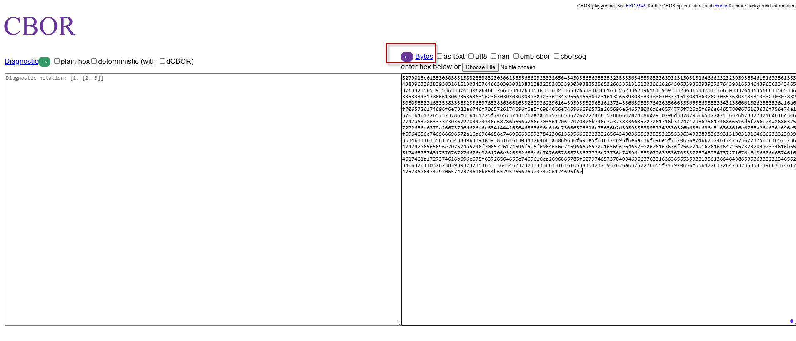
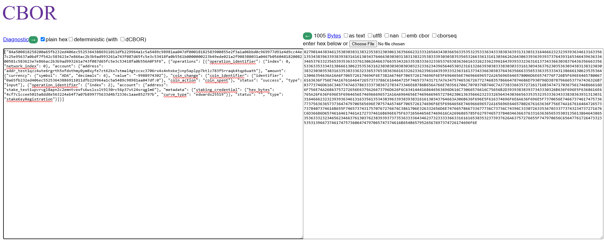
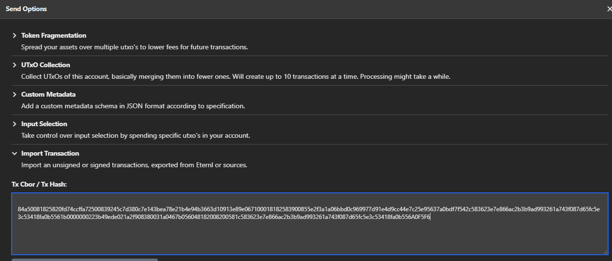
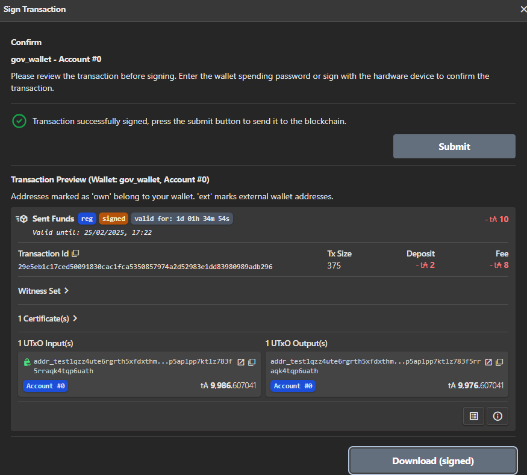
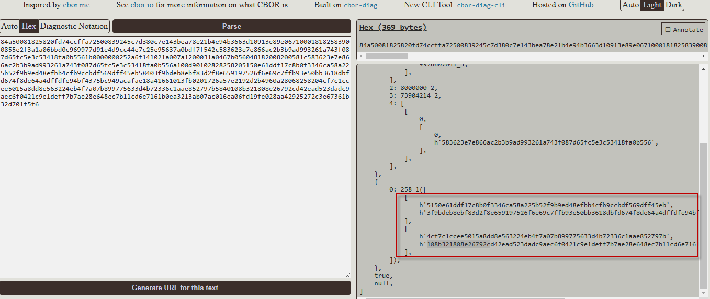
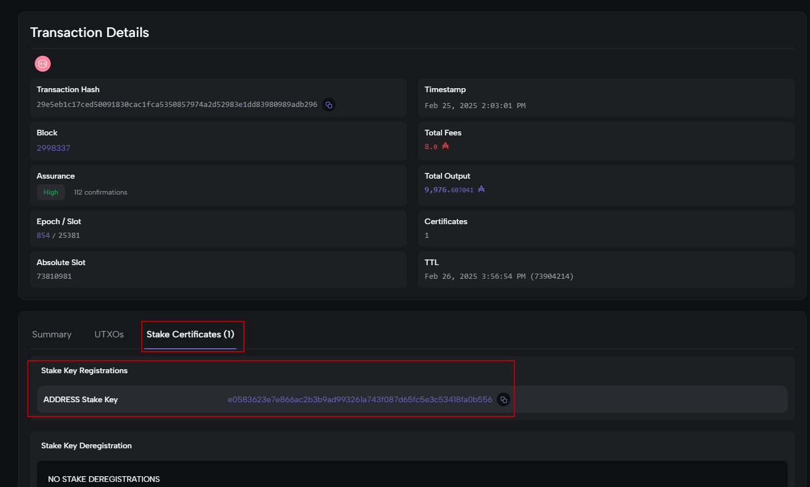

# Building & submitting stakeRegistration operations transactions in rosetta
## Step 1:  construct a request for metadata

Using /construction/preprocess end-point to construct a request for any metadata that is needed for transaction construction
```
curl --location 'localhost:8082/construction/preprocess' \
--header 'Content-Type: application/json' \
--data '{
  "metadata": {
    "deposit_parameters": {
      "poolDeposit": "500000000",
      "keyDeposit": "2000000"
    }
  },
  "network_identifier": {
    "blockchain": "cardano",
    "network": "preview"
  },

    "operations": [
        {
        
            "operation_identifier": {
                "index": 0,
                "network_index": 0
            },
            "type": "input",
            "status": "success",
            "account": {
                "address": "addr_test1qzz4ute6rgrth5xfdxthmy0ym8xyfe7zt62kx7stmal4gtzcxc3706rx4s4nhxkejvnp5aplpp7ktlz783f5rraqk4tqp6uath"
            },
            "amount": {
                "value": "-9988974302",
                "currency": {
                    "symbol": "ADA",
                    "decimals": 6
                }
            },
            "coin_change": {
                "coin_identifier": {
                    "identifier": "fd74ccffa72500839245c7d380c7e143bea78e21b4e94b3663d10913e89e0671:0"
                },
                "coin_action": "coin_spent"
            }
        },
        
        {
            "operation_identifier": {
                "index": 1
            },
            "related_operations": [
                {
                    "index": 0
                }
            ],
            "type": "output",
            "status": "",
            "account": {
                "address": "addr_test1qzz4ute6rgrth5xfdxthmy0ym8xyfe7zt62kx7stmal4gtzcxc3706rx4s4nhxkejvnp5aplpp7ktlz783f5rraqk4tqp6uath"
            },
            "amount": {
                "value": "9188974302",
                "currency": {
                    "symbol": "ADA",
                    "decimals": 6
                }
            }
        },
        
        {
            "operation_identifier": {
                "index": 2
            },
            "type": "stakeKeyRegistration",
            "status": "",
            "account": {
        
                "address": "stake_test1upvrvgl8apn2c2emntvexfs6wslsslt9l30rc56p37st24srqglm6"
            },
            "metadata": {
                "staking_credential": {
        
                    "hex_bytes": "4cf7c1ccee5015a8dd8e563224eb4f7a07b899775633d4b72336c1aae852797b",   
                    "curve_type": "edwards25519"
                }
            }
        }
    ]
}'
```
The above query will return

```
{
    "options": {
        "relative_ttl": 1000,
        "transaction_size": 261
    }
}
```
We will bring these info to the next step

## Step 2:  to get metadata for transaction construction

using construction/metadata to get metadata for transaction construction

```
curl --location 'localhost:8082/construction/metadata' \
--header 'Content-Type: application/json' \
--data '{
    "network_identifier": {
        "blockchain": "cardano",
        "network": "preview"
    },
    "options": {
        "relative_ttl": 1000,
        "transaction_size": 261
    }
    }
}'
```
this end point will return us the output as below:

```
{
    "metadata": {
        "ttl": 73804214,
        "protocol_parameters": {
            "coinsPerUtxoSize": "4310",
            "maxTxSize": 16384,
            "maxValSize": 5000,
            "keyDeposit": "2000000",
            "maxCollateralInputs": 3,
            "minFeeCoefficient": 44,
            "minFeeConstant": 155381,
            "minPoolCost": "170000000",
            "poolDeposit": "500000000",
            "protocol": 10
        }
    },
    "suggested_fee": [
        {
            "value": "167041",
            "currency": {
                "symbol": "ADA",
                "decimals": 6
            }
        }
    ]
}
```

## Step 3:  Generate an Unsigned Transaction
In this step we use /construction/payloads to generate an unsigned transaction

```
{
  "metadata": {
    "deposit_parameters": {
      "poolDeposit": "500000000",
      "keyDeposit": "2000000"
    }
  },
  "network_identifier": {
    "blockchain": "cardano",
    "network": "{{networkId}}"
  },

    "operations": [
        {
        // 1.=================INPUT: You need to indicate the address and UTXO you will spend here ==================== 
            "operation_identifier": {
                "index": 0,
                "network_index": 0
            },
            "type": "input",
            "status": "success",
            "account": {
                "address": "addr_test1qzz4ute6rgrth5xfdxthmy0ym8xyfe7zt62kx7stmal4gtzcxc3706rx4s4nhxkejvnp5aplpp7ktlz783f5rraqk4tqp6uath"
            },
            "amount": {
                "value": "-9988974302",
                "currency": {
                    "symbol": "ADA",
                    "decimals": 6
                }
            },
            "coin_change": {
                "coin_identifier": {
                    "identifier": "fd74ccffa72500839245c7d380c7e143bea78e21b4e94b3663d10913e89e0671:0"
                },
                "coin_action": "coin_spent"
            }
        },
        // 2.=================OUTPUT: You declare new outputs here.====================================================== 
        {
            "operation_identifier": {
                "index": 1
            },
            "related_operations": [
                {
                    "index": 0
                }
            ],
            "type": "output",
            "status": "",
            "account": {
                "address": "addr_test1qzz4ute6rgrth5xfdxthmy0ym8xyfe7zt62kx7stmal4gtzcxc3706rx4s4nhxkejvnp5aplpp7ktlz783f5rraqk4tqp6uath"
            },
            "amount": {
                "value": "9188974302",
                "currency": {
                    "symbol": "ADA",
                    "decimals": 6
                }
            }
        },
        // 3.=================STAKE KEY REGISTRATION  ==================== 
        {
            "operation_identifier": {
                "index": 2
            },
            "type": "stakeKeyRegistration",
            "status": "",
            "account": {
        // 3.1.============The stake address you want to register
                "address": "stake_test1upvrvgl8apn2c2emntvexfs6wslsslt9l30rc56p37st24srqglm6"
            },
            "metadata": {
                "staking_credential": {
        // 3.2.=============Stake address vkey in Hex: which could be retrived by running `cardano-address key inspect <stake.xvk`===
                    "hex_bytes": "4cf7c1ccee5015a8dd8e563224eb4f7a07b899775633d4b72336c1aae852797b",   
                    "curve_type": "edwards25519"
                }
            }
        }
    ],
        // 4.==============The metadata is copied from output of construction/metadata end point ============
       "metadata": {
        "ttl": 73804214,
        "protocol_parameters": {
            "coinsPerUtxoSize": "4310",
            "maxTxSize": 16384,
            "maxValSize": 5000,
            "keyDeposit": "2000000",
            "maxCollateralInputs": 3,
            "minFeeCoefficient": 44,
            "minFeeConstant": 155381,
            "minPoolCost": "170000000",
            "poolDeposit": "500000000",
            "protocol": 10
        }
    },
    "suggested_fee": [
        {
            "value": "167041",
            "currency": {
                "symbol": "ADA",
                "decimals": 6
            }
        }
    ]

}
```
## Step 4:  Decoding and Signing Payloads
 

### Step 4.1:  decode unsign rosetta transaction

Access https://cbor.me/, paste the contents of unsigned_transaction to the right box
```
8279013c61353030383138323538323030613635666232333265643430366563353532353336343338383639313130313164666232323939363461316335613534383963393839383161613034376466303030313831383235383339303038353565326633613161303662626430633936393937376439316534643963633434653763323565393536333761306264663766353432633538333632336537653836366163326233623961643939333236316137343366303837643635666335653363353334313866613062353536316230303030303030323233623439656465303231613266393038333830303331613034363762303536303438313832303038323030353831633538333632336537653836366163326233623961643939333236316137343366303837643635666335653363353334313866613062353536a16a6f7065726174696f6e7382a6746f7065726174696f6e5f6964656e746966696572a265696e646578006d6e6574776f726b5f696e64657800676163636f756e74a16761646472657373786c616464725f7465737431717a7a34757465367267727468357866647874686d7930796d3878796665377a7436326b783773746d616c3467747a6378633337303672783473346e68786b656a766e703561706c7070376b746c7a3738336635727261716b34747170367561746866616d6f756e74a26863757272656e6379a26673796d626f6c6341444168646563696d616c73066576616c75656b2d393938383937343330326b636f696e5f6368616e6765a26f636f696e5f6964656e746966696572a16a6964656e7469666965727842306136356662323332656434303665633535323533363433383836393131303131646662323239393634613163356135343839633938393831616130343764663a306b636f696e5f616374696f6e6a636f696e5f7370656e74667374617475736773756363657373647479706565696e707574a5746f7065726174696f6e5f6964656e746966696572a165696e64657802676163636f756e74a1676164647265737378407374616b655f74657374317570767276676c3861706e326332656d6e7476657866733677736c73736c74396c33307263353670333773743234737271676c6d36686d65746164617461a1727374616b696e675f63726564656e7469616ca2696865785f62797465737840346366376331636365653530313561386464386535363332323465623466376130376238393937373536333364346237323333366331616165383532373937626a63757276655f747970656c65647761726473323535313966737461747573606474797065747374616b654b6579526567697374726174696f6e
```

it looks as this image, 


and click <- icon 




### Step 4.2: Signing transaction
In this example we use Eternl wallet  to sign transaction, you could use cardano-cli or other tool to sign.
```
a50081825820fd74ccffa72500839245c7d380c7e143bea78e21b4e94b3663d10913e89e067100018182583900855e2f3a1a06bbd0c969977d91e4d9cc44e7c25e95637a0bdf7f542c583623e7e866ac2b3b9ad993261a743f087d65fc5e3c53418fa0b5561b0000000223b49ede021a2f908380031a0467b056048182008200581c583623e7e866ac2b3b9ad993261a743f087d65fc5e3c53418fa0b556
```
we convert rosetta unsign transaction to the format that Eternl wallet could understand by:
- Add 84 to begining of CBOR
- Add A0F5F6 to the end of CBOR

```
84a50081825820fd74ccffa72500839245c7d380c7e143bea78e21b4e94b3663d10913e89e067100018182583900855e2f3a1a06bbd0c969977d91e4d9cc44e7c25e95637a0bdf7f542c583623e7e866ac2b3b9ad993261a743f087d65fc5e3c53418fa0b5561b0000000223b49ede021a2f908380031a0467b056048182008200581c583623e7e866ac2b3b9ad993261a743f087d65fc5e3c53418fa0b556A0F5F6
```
copy this CBOR to Eternl wallet to sign


Select Download (signed) button to download signed CBOR, you could submit transaction from here or using submit end-point


## Step 5: Submit transaction using submit end point
We only perform these below step if you did not use submit function of Eternl wallet

### Step 5.1: Retrieved signatures from signed transaction
Open the file you have download 

```
{
  "type": "Tx BabbageEra",
  "description": "signed",
  "cborHex": "84a50081825820fd74ccffa72500839245c7d380c7e143bea78e21b4e94b3663d10913e89e067100018182583900855e2f3a1a06bbd0c969977d91e4d9cc44e7c25e95637a0bdf7f542c583623e7e866ac2b3b9ad993261a743f087d65fc5e3c53418fa0b5561b0000000252a6f141021a007a1200031a0467b056048182008200581c583623e7e866ac2b3b9ad993261a743f087d65fc5e3c53418fa0b556a100d90102828258205150e61ddf17c8b0f3346ca58a225b52f9b9ed48efbb4cfb9ccbdf569dff45eb58403f9bdeb8ebf83d2f8e659197526f6e69c7ffb93e50bb3618dbfd674f8de64a4dffdfe94bf4375bc949acafae18a41661013fb0201726a57e2192d2b4960a28068258204cf7c1ccee5015a8dd8e563224eb4f7a07b899775633d4b72336c1aae852797b5840108b321808e26792cd42ead523dadc9aec6f0421c9e1deff7b7ae28e648ec7b11cd6e7161b0ea3213ab07ac016ea06fd19fe028aa42925272c3e67361b32d701f5f6"
}
```
Using https://cbor.nemo157.com/ to decode to see signatures, we need these signatures in the next steps




### Step 5.2: Submit sign transaction in rosetta

Copy unsign message from Step 4.1:  decode unsign rosetta transaction and adding signature from step 5.1 to `signatures` areas:
```
 curl --location 'localhost:8082/construction/combine' \
--header 'Content-Type: application/json' \
--data '{
    "network_identifier": {
        "blockchain": "cardano",
        "network": "preview"
    },
    "unsigned_transaction": "8279013c61353030383138323538323066643734636366666137323530303833393234356337643338306337653134336265613738653231623465393462333636336431303931336538396530363731303030313831383235383339303038353565326633613161303662626430633936393937376439316534643963633434653763323565393536333761306264663766353432633538333632336537653836366163326233623961643939333236316137343366303837643635666335653363353334313866613062353536316230303030303030323532613666313431303231613030376131323030303331613034363762303536303438313832303038323030353831633538333632336537653836366163326233623961643939333236316137343366303837643635666335653363353334313866613062353536a16a6f7065726174696f6e7382a6746f7065726174696f6e5f6964656e746966696572a265696e646578006d6e6574776f726b5f696e64657800676163636f756e74a16761646472657373786c616464725f7465737431717a7a34757465367267727468357866647874686d7930796d3878796665377a7436326b783773746d616c3467747a6378633337303672783473346e68786b656a766e703561706c7070376b746c7a3738336635727261716b34747170367561746866616d6f756e74a26863757272656e6379a26673796d626f6c6341444168646563696d616c73066576616c75656b2d393938363630373034316b636f696e5f6368616e6765a26f636f696e5f6964656e746966696572a16a6964656e7469666965727842666437346363666661373235303038333932343563376433383063376531343362656137386532316234653934623336363364313039313365383965303637313a306b636f696e5f616374696f6e6a636f696e5f7370656e74667374617475736773756363657373647479706565696e707574a5746f7065726174696f6e5f6964656e746966696572a165696e64657802676163636f756e74a1676164647265737378407374616b655f74657374317570767276676c3861706e326332656d6e7476657866733677736c73736c74396c33307263353670333773743234737271676c6d36686d65746164617461a1727374616b696e675f63726564656e7469616ca2696865785f62797465737840346366376331636365653530313561386464386535363332323465623466376130376238393937373536333364346237323333366331616165383532373937626a63757276655f747970656c65647761726473323535313966737461747573606474797065747374616b654b6579526567697374726174696f6e",
    "signatures": [
        {
            "signing_payload": {
                
            "account_identifier": {
                "address": "addr_test1qzz4ute6rgrth5xfdxthmy0ym8xyfe7zt62kx7stmal4gtzcxc3706rx4s4nhxkejvnp5aplpp7ktlz783f5rraqk4tqp6uath",
                "metadata": {
                "chain_code": "dd75e154da417becec55cdd249327454138f082110297d5e87ab25e15fad150f"
                            }
            },
            "hex_bytes": "9f027e96e69033e5d60d6de59bc18a1170b23c5c43f4d2813033350f743c246b",
            "signature_type": "ed25519"
            },
            
            "public_key": {
                "hex_bytes": "5150e61ddf17c8b0f3346ca58a225b52f9b9ed48efbb4cfb9ccbdf569dff45eb",
                "curve_type": "edwards25519"
            },
            "signature_type": "ed25519",
            "hex_bytes": "3f9bdeb8ebf83d2f8e659197526f6e69c7ffb93e50bb3618dbfd674f8de64a4dffdfe94bf4375bc949acafae18a41661013fb0201726a57e2192d2b4960a2806"
        },
            {
            "signing_payload": {
                
            "account_identifier": {
                "address": "addr_test1qzz4ute6rgrth5xfdxthmy0ym8xyfe7zt62kx7stmal4gtzcxc3706rx4s4nhxkejvnp5aplpp7ktlz783f5rraqk4tqp6uath",
                "metadata": {
                "chain_code": "dd75e154da417becec55cdd249327454138f082110297d5e87ab25e15fad150f"
                            }
            },
            "hex_bytes": "9f027e96e69033e5d60d6de59bc18a1170b23c5c43f4d2813033350f743c246b",
            "signature_type": "ed25519"
            },
            
            "public_key": {
                "hex_bytes": "4cf7c1ccee5015a8dd8e563224eb4f7a07b899775633d4b72336c1aae852797b",
                "curve_type": "edwards25519"
            },
            "signature_type": "ed25519",
            "hex_bytes": "108b321808e26792cd42ead523dadc9aec6f0421c9e1deff7b7ae28e648ec7b11cd6e7161b0ea3213ab07ac016ea06fd19fe028aa42925272c3e67361b32d701"
        }
    
    ]
}'
```
The output is rosetta signed transaction

```
{
    "signed_transaction": "827902dc383461353030383138323538323066643734636366666137323530303833393234356337643338306337653134336265613738653231623465393462333636336431303931336538396530363731303030313831383235383339303038353565326633613161303662626430633936393937376439316534643963633434653763323565393536333761306264663766353432633538333632336537653836366163326233623961643939333236316137343366303837643635666335653363353334313866613062353536316230303030303030323532613666313431303231613030376131323030303331613034363762303536303438313832303038323030353831633538333632336537653836366163326233623961643939333236316137343366303837643635666335653363353334313866613062353536613130303832383235383230353135306536316464663137633862306633333436636135386132323562353266396239656434386566626234636662396363626466353639646666343565623538343033663962646562386562663833643266386536353931393735323666366536396337666662393365353062623336313864626664363734663864653634613464666664666539346266343337356263393439616361666165313861343136363130313366623032303137323661353765323139326432623439363061323830363832353832303463663763316363656535303135613864643865353633323234656234663761303762383939373735363333643462373233333663316161653835323739376235383430313038623332313830386532363739326364343265616435323364616463396165633666303432316339653164656666376237616532386536343865633762313163643665373136316230656133323133616230376163303136656130366664313966653032386161343239323532373263336536373336316233326437303166356636a26a6f7065726174696f6e7382a6746f7065726174696f6e5f6964656e746966696572a265696e646578006d6e6574776f726b5f696e64657800676163636f756e74a16761646472657373786c616464725f7465737431717a7a34757465367267727468357866647874686d7930796d3878796665377a7436326b783773746d616c3467747a6378633337303672783473346e68786b656a766e703561706c7070376b746c7a3738336635727261716b34747170367561746866616d6f756e74a26863757272656e6379a26673796d626f6c6341444168646563696d616c73066576616c75656b2d393938363630373034316b636f696e5f6368616e6765a26f636f696e5f6964656e746966696572a16a6964656e7469666965727842666437346363666661373235303038333932343563376433383063376531343362656137386532316234653934623336363364313039313365383965303637313a306b636f696e5f616374696f6e6a636f696e5f7370656e74667374617475736773756363657373647479706565696e707574a5746f7065726174696f6e5f6964656e746966696572a165696e64657802676163636f756e74a1676164647265737378407374616b655f74657374317570767276676c3861706e326332656d6e7476657866733677736c73736c74396c33307263353670333773743234737271676c6d36686d65746164617461a1727374616b696e675f63726564656e7469616ca2696865785f62797465737840346366376331636365653530313561386464386535363332323465623466376130376238393937373536333364346237323333366331616165383532373937626a63757276655f747970656c65647761726473323535313966737461747573606474797065747374616b654b6579526567697374726174696f6e767472616e73616374696f6e4d6574616461746148657860"
}
```

Bring this rosetta signed transaction to submit endpoint

```
curl --location 'localhost:8082/construction/submit' \
--header 'Content-Type: application/json' \
--data '{
  "network_identifier": {
    "blockchain": "cardano",
    "network": "preview"
  },
  "signed_transaction": "827902dc383461353030383138323538323066643734636366666137323530303833393234356337643338306337653134336265613738653231623465393462333636336431303931336538396530363731303030313831383235383339303038353565326633613161303662626430633936393937376439316534643963633434653763323565393536333761306264663766353432633538333632336537653836366163326233623961643939333236316137343366303837643635666335653363353334313866613062353536316230303030303030323532613666313431303231613030376131323030303331613034363762303536303438313832303038323030353831633538333632336537653836366163326233623961643939333236316137343366303837643635666335653363353334313866613062353536613130303832383235383230353135306536316464663137633862306633333436636135386132323562353266396239656434386566626234636662396363626466353639646666343565623538343033663962646562386562663833643266386536353931393735323666366536396337666662393365353062623336313864626664363734663864653634613464666664666539346266343337356263393439616361666165313861343136363130313366623032303137323661353765323139326432623439363061323830363832353832303463663763316363656535303135613864643865353633323234656234663761303762383939373735363333643462373233333663316161653835323739376235383430313038623332313830386532363739326364343265616435323364616463396165633666303432316339653164656666376237616532386536343865633762313163643665373136316230656133323133616230376163303136656130366664313966653032386161343239323532373263336536373336316233326437303166356636a26a6f7065726174696f6e7382a6746f7065726174696f6e5f6964656e746966696572a265696e646578006d6e6574776f726b5f696e64657800676163636f756e74a16761646472657373786c616464725f7465737431717a7a34757465367267727468357866647874686d7930796d3878796665377a7436326b783773746d616c3467747a6378633337303672783473346e68786b656a766e703561706c7070376b746c7a3738336635727261716b34747170367561746866616d6f756e74a26863757272656e6379a26673796d626f6c6341444168646563696d616c73066576616c75656b2d393938363630373034316b636f696e5f6368616e6765a26f636f696e5f6964656e746966696572a16a6964656e7469666965727842666437346363666661373235303038333932343563376433383063376531343362656137386532316234653934623336363364313039313365383965303637313a306b636f696e5f616374696f6e6a636f696e5f7370656e74667374617475736773756363657373647479706565696e707574a5746f7065726174696f6e5f6964656e746966696572a165696e64657802676163636f756e74a1676164647265737378407374616b655f74657374317570767276676c3861706e326332656d6e7476657866733677736c73736c74396c33307263353670333773743234737271676c6d36686d65746164617461a1727374616b696e675f63726564656e7469616ca2696865785f62797465737840346366376331636365653530313561386464386535363332323465623466376130376238393937373536333364346237323333366331616165383532373937626a63757276655f747970656c65647761726473323535313966737461747573606474797065747374616b654b6579526567697374726174696f6e767472616e73616374696f6e4d6574616461746148657860"
}'
```
run the command, we will get the transaction hash returned.

```
{
    "transaction_identifier": {
        "hash": "29e5eb1c17ced50091830cac1fca5350857974a2d52983e1dd83980989adb296"
    }
}
```
and you view transaction on  [cardanoscan](https://preview.cardanoscan.io/transaction/29e5eb1c17ced50091830cac1fca5350857974a2d52983e1dd83980989adb296?tab=stakecertificates)
